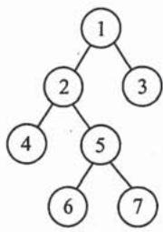

# 2009年数据结构考研真题

## 一、单项选择题

1. 为解决计算机主机与打印机之间速度不匹配问题，通常设置一个打印数据缓冲区，主机将要输出的数据依次写入该缓冲区，而打印机则依次从该缓冲区中取出数据。该缓冲区的逻辑结构应该是**\_\_\_\_**。

A. 栈

B. 队列

C. 树

D. 图

2. 设栈 S 和队列 Q 的初始状态均为空，元素 a, b, c, d, e, f, g 依次进入栈 S。若每个元素出栈后立即进入队列 Q，且 7 个元素出队的顺序是 b, d, c, f, e, a, g，则栈 S 的容量至少是 **\_\_**。

A. 1

B. 2

C. 3

D. 4

3. 给定二叉树如右图所示。设 N 代表二叉树的根，L 代表根结点的左子树，R 代表根结点的右子树。若遍历后的结点序列是 $3,1,7,5,6,2,4$ ，则其遍历方式是

A. LRN

B. NRL

C. RLN

D. RNL

4. 下列二叉排序树中，满足平衡二叉树定义的是

  
A.

  
B.

  
C.

  
D.

5. 已知一棵完全二叉树的第 6 层（设根为第 1 层）有 8 个叶结点，则该完全二叉树的结点个数最多是 **\_\_**。

A. 39

B. 52

C. 111

D. 119

6. 将森林转换为对应的二叉树，若在二叉树中，结点 $\mathbf{u}$ 是结点 $\mathbf{v}$ 的父结点的父结点，则在原来的森林中， $\mathbf{u}$ 和 $\mathbf{v}$ 可能具有的关系是

I. 父子关系

II. 兄弟关系

III. u的父结点与 $\mathbf{v}$ 的父结点是兄弟关系

A. 只有 II

B. I 和 II

C. I 和 III

D. I、II 和 III

7. 下列关于无向连通图特性的叙述中,正确的是**\_**。

I. 所有顶点的度之和为偶数  
II. 边数大于顶点个数减 1  
III. 至少有一个顶点的度为 1

A. 只有 I

B. 只有 II

C. I 和 II

D. I 和 III

8. 下列叙述中，不符合 $m$ 阶B树定义要求的是\_\_\_\_。

A. 根结点最多有 $m$ 棵子树

B. 所有叶结点都在同一层上

C. 各结点内关键字均升序或降序排列

D. 叶结点之间通过指针链接

9. 已知关键字序列 5, 8, 12, 19, 28, 20, 15, 22 是小根堆（最小堆），插入关键字 3，调整后得到的小根堆是 **\_\_**。

A. 3, 5, 12, 8, 28, 20, 15, 22, 19

B. 3,5,12,19,20,15,22,8,28

C. 3, 8, 12, 5, 20, 15, 22, 28, 19

D. 3, 12, 5, 8, 28, 20, 15, 22, 19

10. 若数据元素序列 11, 12, 13, 7, 8, 9, 23, 4, 5 是采用下列排序方法之一得到的第二趟排序后的结果，则该排序算法只能是

A. 冒泡排序

B. 插入排序

C. 选择排序

D. 二路归并排序

## 二、综合应用题

41.（10分）带权图（权值非负，表示边连接的两顶点间的距离）的最短路径问题是找出从初始顶点到目标顶点之间的一条最短路径。假设从初始顶点到目标顶点之间存在路径，现有一种解决该问题的方法：

(1) 设最短路径初始时仅包含初始顶点, 令当前顶点 $\mathbf{u}$ 为初始顶点;  
② 选择离 $\mathbf{u}$ 最近且尚未在最短路径中的一个顶点 $\mathbf{v}$ , 加入最短路径中, 修改当前顶点 $\mathbf{u} = \mathbf{v}$ ;  
(3) 重复步骤②, 直到 u 是目标顶点时为止。

请问上述方法能否求得最短路径？若该方法可行，请证明之；否则，请举例说明。

42.（15分）已知一个带有表头结点的单链表，结点结构为

<table><tr><td>data</td><td>link</td></tr></table>

假设该链表只给出了头指针 list。在不改变链表的前提下，请设计一个尽可能高效的算法，查找链表中倒数第 $k$ 个位置上的结点（ $k$ 为正整数）。若查找成功，算法输出该结点的 data 域的值，并返回 1；否则，只返回 0。要求：

1）描述算法的基本设计思想。  
2）描述算法的详细实现步骤。  
3）根据设计思想和实现步骤，采用程序设计语言描述算法（使用 C、C++ 或 Java 语言实现），关键之处请给出简要注释。
