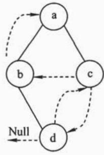
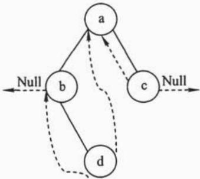
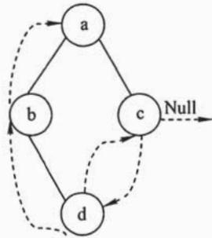
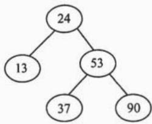

# 2010年数据结构考研真题

## 一、单项选择题

1. 若元素 a, b, c, d, e, f 依次进栈，允许进栈、退栈操作交替进行，但不允许连续三次进行退栈操作，则不可能得到的出栈序列是 ______。

A. dcebfa

B. cbdaef

C. bcaefd

D. afedcb

2. 某队列允许在其两端进行入队操作，但仅允许在一端进行出队操作。若元素a,b,c,d,e依次入此队列后再进行出队操作，则不可能得到的出队序列是

A. baced

B. dbace

C. dbcae

D. ecbad

3. 下列线索二叉树中（用虚线表示线索），符合后序线索树定义的是____。

  
A.

  
B.

  
C.

  
D.

4. 在右图所示的平衡二叉树中，插入关键字 48 后得到一棵新平衡二叉树。在新平衡二叉树中，关键字 37 所在结点的左、右子结点中保存的关键字分别是

A. 13,48

B. 24, 48

C. 24,53

D. 24, 90

5. 在一棵度为 4 的树 T 中，若有 20 个度为 4 的结点，10 个度为 3 的结点，1 个度为 2 的结点，10 个度为 1 的结点，则树 T 的叶结点个数是

A. 41

B. 82

C. 113

D. 122

6. 对 $n$ ( $n \geq  2$ )个权值均不相同的字符构造成哈夫曼树。下列关于该哈夫曼树的叙述中,错误的是_____。

A. 该树一定是一棵完全二叉树  
B. 树中一定没有度为 1 的结点  
C. 树中两个权值最小的结点一定是兄弟结点  
D. 树中任一非叶结点的权值一定不小于下一层任一结点的权值

7. 若无向图 $\mathrm{G} = (\mathrm{V}, \mathrm{E})$ 中含有 7 个顶点，要保证图 $\mathrm{G}$ 在任何情况下都是连通的，则需要的边数最少是 ______。

A. 6

B. 15

C. 16

D. 21

8. 对右图进行拓扑排序, 可以得到不同的拓扑序列的个数是

A. 4   
B. 3   
C. 2   
D. 1

9. 已知一个长度为 16 的顺序表 L，其元素按关键字有序排列。若采用折半查找法查找一个 L 中不存在的元素，则关键字的比较次数最多的是 ________。

A. 4   
B. 5   
C. 6   
D. 7

10. 采用递归方式对顺序表进行快速排序。下列关于递归次数的叙述中, 正确的是____。

A. 递归次数与初始数据的排列次序无关  
B. 每次划分后, 先处理较长的分区可以减少递归次数  
C. 每次划分后, 先处理较短的分区可以减少递归次数  
D. 递归次数与每次划分后得到的分区的处理顺序无关

11. 对一组数据（2,12,16,88,5,10）进行排序，若前三趟排序结果如下：

第一趟排序结果：2,12,16,5,10,88

第二趟排序结果：2,12,5,10,16,88

第三趟排序结果：2,5,10,12,16,88

则采用的排序方法可能是

A. 冒泡排序

B. 希尔排序

C. 归并排序

D. 基数排序

## 二、综合应用题

41.（10分）将关键字序列（7,8,30,11,18,9,14）散列存储到散列表中。散列表的存储空间是一个下标从0开始的一维数组，散列函数为 $\mathrm{H(key) = (key\times 3)\bmod 7}$ ，处理冲突采用线性探测再散列法，要求装填（载）因子为0.7。

1）请画出所构造的散列表。

2）分别计算等概率情况下查找成功和查找不成功的平均查找长度。

42.（13分）设将 $n(n > 1)$ 个整数存放到一维数组R中。试设计一个在时间和空间两方面都尽可能高效的算法。将R中保存的序列循环左移 $p(0 < p < n)$ 个位置，即将R中的数据由 $(\mathbf{X}_0,\mathbf{X}_1,\dots ,\mathbf{X}_{n - 1})$ 变换为 $(\mathrm{X}_p,\mathrm{X}_{p + 1},\dots ,\mathrm{X}_{n - 1},\mathrm{X}_0,\mathrm{X}_1,\dots ,\mathrm{X}_{p - 1})$ 。要求：

1）给出算法的基本设计思想。

2) 根据设计思想, 采用 C、C++或 Java 语言描述算法, 关键之处给出注释。

3）说明你所设计算法的时间复杂度和空间复杂度。