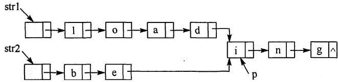

# 2012年数据结构考研真题

## 一、单项选择题

1. 求整数n($n \geq 0$)阶乘的算法如下，其时间复杂度是

```c
int fact(int n){
  if(n <= 1) return 1;
  return n*fact(n-1);
}
```

A. $O(\log_2 n)$

B. O(n)

C. O(nlog2n)

D. $O(n^2)$

2. 已知操作符包括'+'、'-'、'*'、'/'、'('和')'。将中缀表达式 $\mathbf{a+b-a*((c+d)/e-f)+g}$ 转换为等价的后缀表达式 $\mathbf{ab+acd+e/f-* -g+}$ 时，用栈来存放暂时还不能确定运算次序的操作符，若栈初始时为空，则转换过程中同时保存在栈中的操作符的最大个数是

A. 5

B. 7

C. 9

D. 11

3. 若一棵二叉树的前序遍历序列为a,e,b,d,c，后序遍历序列为b,c,d,e,a，则根结点的孩子结点

A. 只有e

B. 有e、b

C. 有e、c

D. 无法确定

4. 若平衡二叉树的高度为6，且所有非叶结点的平衡因子均为1，则该平衡二叉树的结点总数为

A. 10

B. 20

C. 32

D. 33

5. 对有 $n$ 个结点、$e$ 条边且使用邻接表存储的有向图进行广度优先遍历，其算法时间复杂度是

A. O(n)

B. O(e)

C. $O(n+e)$

D. O(ne)

6. 若用邻接矩阵存储有向图，矩阵中主对角线以下的元素均为零，则关于该图拓扑序列的结论是

A. 存在，且唯一

B. 存在，且不唯一

C. 存在，可能不唯一

D. 无法确定是否存在

7. 如右图所示的有向带权图，若采用迪杰斯特拉(Dijkstra)算法求从源点a到其他各顶点的最短路径，则得到的第一条最短路径的目标顶点是b，第二条最短路径的目标顶点是c，后续得到的其余各最短路径的目标顶点依次是


A. d,e,f

B. e,d,f

C. f,d,e

D. f,e,d

8. 下列关于最小生成树的叙述中，正确的是

I. 最小生成树的代价唯一

II. 所有权值最小的边一定会出现在所有的最小生成树中  
III. 使用普里姆(Prim)算法从不同顶点开始得到的最小生成树一定相同  
IV. 使用普里姆算法和克鲁斯卡尔(Kruskal)算法得到的最小生成树总不相同

A. 仅I

B. 仅II

C. 仅I、III

D. 仅II、IV

9. 已知一棵3阶B-树，如下图所示。删除关键字78得到一棵新B-树，其最右叶结点中的关键字是


A. 60

B. 60 62

C. 62,65

D. 65

10. 在内部排序过程中，对尚未确定最终位置的所有元素进行一遍处理称为一趟排序。下列排序方法中，每一趟排序结束都至少能够确定一个元素最终位置的方法是

I. 简单选择排序

II. 希尔排序

III. 快速排序

IV. 堆排序

V. 二路归并排序

A. 仅I、III、IV

B. 仅I、III、V

C. 仅II、III、IV

D. 仅III、IV、V

11. 对一待排序序列分别进行折半插入排序和直接插入排序，两者之间可能的不同之处是

A. 排序的总趟数

B. 元素的移动次数

C. 使用辅助空间的数量

D. 元素之间的比较次数

## 二、综合应用题

41. 设有6个有序表A、B、C、D、E、F, 分别含有10、35、40、50、60和200个数据元素， 各表中元素按升序排列。 要求通过5次两两合并， 将6个表最终合并成1个升序表， 并在最坏情况下比较的总次数达到最小。请回答下列问题。

1)给出完整的合并过程， 并求出最坏情况下比较的总次数。  
2)根据你的合并过程， 描述N($N \geq 2$)个不等长升序表的合并策略， 并说明理由。

42. 假定采用带头结点的单链表保存单词， 当两个单词有相同的后缀时， 则可共享相同的后缀存储空间， 例如，"loading"和"being" 的存储映像如下图所示。



设strl和 str2分别指向两个单词所在单链表的头结点， 链表结点结构为[data][next]， 请设计一个时间上尽可能高效的算法， 找出由strl和str2所指向两个链表共同后缀的起始位置（如图中字符i所在结点的位置p)。 要求：

1)给出算法的基本设计思想。

2)根据设计思想， 采用C或C++或Java语言描述算法， 关键之处给出注释。

3)说明你所设计算法的时间复杂度。