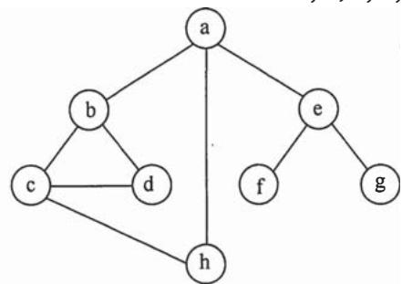
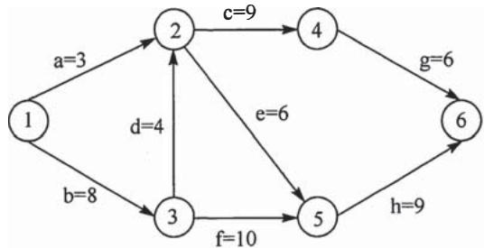

# 2013年数据结构考研真题

## 一、单项选择题

1. 已知两个长度分别为 $m$ 和 $n$ 的升序链表，若将它们合并为一个长度为 $m + n$ 的降序链表，则最坏情况下的时间复杂度是 ______。

A. $\mathrm{O}(n)$

B. $\mathrm{O}(mn)$

C. $\mathrm{O}(\min(m,n))$

D. $\mathrm{O}(\max(m,n))$

2. 一个栈的入栈序列为 $1, 2, 3, \dots, n$ ，其出栈序列是 $\mathfrak{p}_1, \mathfrak{p}_2, \mathfrak{p}_3, \dots, \mathfrak{p}_n$ 。若 $\mathfrak{p}_2 = 3$ ，则 $\mathfrak{p}_3$ 可能取值的个数是 ______。

A. $n - 3$

B. $n - 2$

C. $n - 1$

D. 无法确定

3. 若将关键字 1,2,3,4,5,6,7 依次插入到初始为空的平衡二叉树 T 中，则 T 中平衡因子为 0 的分支结点的个数是

A. 0

B. 1

C. 2

D. 3

4. 已知三叉树 T 中 6 个叶结点的权分别是 2,3,4,5,6,7，T 的带权（外部）路径长度最小是

A. 27

B. 46

C. 54

D. 56

5. 若 X 是后序线索二叉树中的叶结点，且 X 存在左兄弟结点 Y，则 X 的右线索指向的是____。

A. X 的父结点

B. 以 $\mathrm{Y}$ 为根的子树的最左下结点

C. X 的左兄弟结点 Y

D. 以 $\mathrm{Y}$ 为根的子树的最右下结点

6. 在任意一棵非空二叉排序树 $\mathrm{T}_{1}$ 中，删除某结点 $\mathbf{v}$ 之后形成二叉排序树 $\mathrm{T}_{2}$ ，再将 $\mathbf{v}$ 插入 $\mathrm{T}_{2}$ 形成二叉排序树 $\mathrm{T}_{3}$ 。下列关于 $\mathrm{T}_{1}$ 与 $\mathrm{T}_{3}$ 的叙述中，正确的是 ______。

I. 若 $\mathbf{v}$ 是 $\mathrm{T}_{1}$ 的叶结点，则 $\mathrm{T}_{1}$ 与 $\mathrm{T}_{3}$ 不同

II. 若 $\mathbf{v}$ 是 $\mathrm{T}_{1}$ 的叶结点，则 $\mathrm{T}_{1}$ 与 $\mathrm{T}_{3}$ 相同

III. 若 $\mathrm{v}$ 不是 ${\mathrm{T}}_{1}$ 的叶结点,则 ${\mathrm{T}}_{1}$ 与 ${\mathrm{T}}_{3}$ 不同

IV. 若 $\mathrm{v}$ 不是 ${\mathrm{T}}_{1}$ 的叶结点,则 ${\mathrm{T}}_{1}$ 与 ${\mathrm{T}}_{3}$ 相同

A. 仅 I、III

B. 仅 I、IV

C. 仅 II、III

D. 仅 II、IV

7. 设图的邻接矩阵 $A$ 如下所示。各顶点的度依次是

$$
A = \left[ \begin{array}{l l l l} 0 & 1 & 0 & 1 \\ 0 & 0 & 1 & 1 \\ 0 & 1 & 0 & 0 \\ 1 & 0 & 0 & 0 \end{array} \right]
$$

A. 1,2,1,2

B. 2,2,1,1

C. $3,4,2,3$

D. 4, 4, 2, 2

8. 若对如下无向图进行遍历，则下列选项中，不是广度优先遍历序列的是

A. h, c, a, b, d, e, g, f

B. e, a, f, g, b, h, c, d

C. d, b, c, a, h, e, f, g

D. a, b, c, d, h, e, f, g

9. 下列 AOE 网表示一项包含 8 个活动的工程。通过同时加快若干活动的进度可以缩短整个工程的工期。下列选项中, 加快其进度就可以缩短工程工期的是

A. c 和 e

B. d 和 e

C. f和d

D. f和h

10. 在一棵高度为 2 的 5 阶 B 树中，所含关键字的个数最少是

A. 5

B. 7

C. 8

D. 14

11. 对给定的关键字序列110,119,007,911,114,120,122进行基数排序，则第2趟分配收集后得到的关键字序列是

A. 007, 110, 119, 114, 911, 120, 122

B. 007, 110, 119, 114, 911, 122, 120

C. 007, 110, 911, 114, 119, 120, 122

D. 110, 120, 911, 122, 114, 007, 119

## 二、综合应用题

41.（13分）已知一个整数序列 $\mathrm{A} = (a_{0}, a_{1}, \dots, a_{n - 1})$ ，其中 $0 \leqslant a_{i} < n$ （ $0 \leqslant i < n$ ）。若存在 $a_{p1} = a_{p2} = \dots = a_{pm} = x$ 且 $m > n / 2$ （ $0 \leqslant p_{k} < n, 1 \leqslant k \leqslant m$ ），则称 $x$ 为 A 的主元素。例如 $\mathrm{A} = (0, 5, 5, 3, 5, 7, 5, 5)$ ，则 5 为主元素；又如 $\mathrm{A} = (0, 5, 5, 3, 5, 1, 5, 7)$ ，则 A 中没有主元素。假设 A 中的 $n$ 个元素保存在一个一维数组中，请设计一个尽可能高效的算法，找出 A 的主元素。若存在主元素，则输出该元素；否则输出-1。要求：

(1) 给出算法的基本设计思想。  
(2) 根据设计思想, 采用 C、C++或 Java 语言描述算法, 关键之处给出注释。  
(3) 说明你所设计算法的时间复杂度和空间复杂度。

42.（10分）设包含4个数据元素的集合 $\mathrm{S} = \{\text{"do"，"for"，"repeat"，"while"}\}$ ，各元素的查找概率依次为 $p_1 = 0.35$ ， $p_2 = 0.15$ ， $p_3 = 0.15$ ， $p_4 = 0.35$ 。将S保存在一个长度为4的顺序表中，采用折半查找法，查找成功时的平均查找长度为2.2。请回答：

（1）若采用顺序存储结构保存S，且要求平均查找长度更短，则元素应如何排列？应使用何种查找方法？查找成功时的平均查找长度是多少？  
(2) 若采用链式存储结构保存 S, 且要求平均查找长度更短, 则元素应如何排列? 应使用何种查找方法? 查找成功时的平均查找长度是多少?