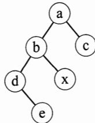
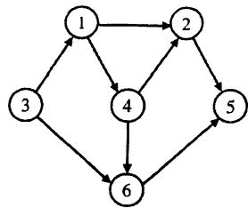

# 2014年数据结构考研真题

## 一、单项选择题

1. 下列程序段的时间复杂度是 。

$$
\begin{array}{l} \text {count} = 0; \\ \text {for (k = 1 ; k <  = n ; k *= 2)} \\ \text {for (j = 1 ; j <  = n ; j + +)} \\ \text {count + + ;} \end{array}
$$

A. $O(\log_2 n)$

B. $O(n)$

C. $O(n\log_2 n)$

D. $O(n^2)$

2. 假设栈初始为空，将中缀表达式 $\mathbf { a } / \mathbf { b } + ( \mathbf { c } * \mathbf { d } - \mathbf { e } * \mathbf { f } ) / \mathbf { g }$ 转换为等价的后缀表达式的过程中，当扫描到f时，栈中的元素依次是 _。

A. $+ ( * -$

B. $+(−*$

C. $/+(*-$

D. $/+*-$

3. 循环队列放在一维数组 $\mathbf { A } [ 0 \ldots M - 1 ]$ 中，end1指向队头元素，end2指向队尾元素的后一个位置。假设队列两端均可进行入队和出队操作，队列中最多能容纳 $M-1$ 个元素。初始时为空。下列判断队空和队满的条件中，正确的是 。

A. 队空：end1 $== $ end2;

队满：end1== (end2 + 1) mod M

B. 队空：end1 $= $ end2;

队满：end2 == (end1 + 1) mod (M-1)

C. 队空：end2 $= $ (end1 + 1) mod M;

队满：end1 $= = ( \mathbf { e n d } 2 + 1 )$ mod $M$

D. 队空：end1 $= = $ (end2 + 1) mod M;

队满：end2 $=$ (end1 $+ 1$ ) mod (M-1)

4. 若对如下的二叉树进行中序线索化，则结点 $\mathbf { x }$ 的左、右线索指向的结点分别是 。

A. e、c

B. e、a

C. b、c

D. b、a

5. 将森林F转换为对应的二叉树T，F中叶结点的个数等于

A. T中叶结点的个数

B. T中度为1的结点个数

C. T中左孩子指针为空的结点个数

D. T中右孩子指针为空的结点个数

6. 5个字符有如下4种编码方案，不是前缀编码的是

A. 01,0000,0001,001,1

B. 011,000,001,010,1

C. 000,001,010,011,100

D. 0,100,110,1110,1100

7. 对如下所示的有向图进行拓扑排序，得到的拓扑序列可能是 。

A. 3,1,2,4,5,6

B. 3,1,2,4,6,5

C. 3,1,4,2,5,6

D. 3,1,4,2,6,5

8. 用哈希（散列）方法处理冲突（碰撞）时可能出现堆积（聚集）现象。 下列选项中，会受堆积现象直接影响的是 。

A. 存储效率

B. 散列函数

C. 装填（装载）因子

D. 平均查找长度

9. 在一棵具有15个关键字的4阶B树中， 含关键字的结点个数最多是 。

A. 5

B. 6

C. 10

D. 15

10. 用希尔排序方法对一个数据序列进行排序时，若第1趟排序结果为9,1,4,13,7,8,20,23,15, 则该趟排序采用的增量（间隔）可能是 。

A. 2

B. 3

C. 4

D. 5

11. 下列选项中，不可能是快速排序第2趟排序结果的是 。

A. 2,3,5,4,6,7,9

B. 2,7,5,6,4,3,9

C. 3,2,5,4, 7,6,9

D. 4,2, 3,5,7,6,9

## 二、综合应用题

41. (13分）二叉树的带权路径长度(WPL)是二叉树中所有叶结点的带权路径长度之和。给定一棵二叉树T , 采用二叉链表存储， 结点结构如下：

<table><tr><td>left</td><td>weight</td><td>right</td></tr></table>

其中叶结点的weight域保存该结点的非负权值。 设root为指向T的根结点的指针， 请设计求T的WPL的算法， 要求：

1)给出算法的基本设计思想。  
2)使用C或C++语言， 给出二叉树结点的数据类型定义。  
3)根据设计思想， 采用C或C++语言描述算法， 关键之处给出注释。