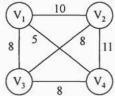
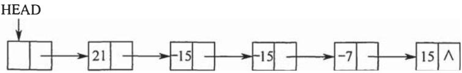
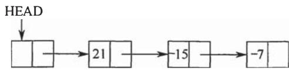
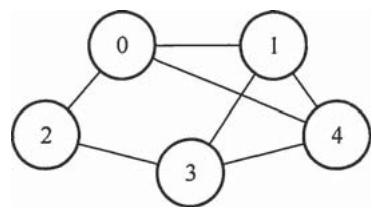

# 2015年数据结构考研真题

## 一、单项选择题

1. 已知程序如下：

```c
int S(int n)  
{ return (n <= 0)?0:s(n-1)+n;}  
void main()  
{ cout << S(1);} 
```

程序运行时使用栈来保存调用过程的信息，自栈底到栈顶保存的信息依次对应的是

A. $\operatorname{main}() \rightarrow \operatorname{S}(1) \rightarrow \operatorname{S}(0)$

B. $\mathrm{S}(0) \rightarrow \mathrm{S}(1) \rightarrow \mathrm{main}()$

C. main()→S(0)→S(1)

D. $\mathrm{S}(1) \rightarrow \mathrm{S}(0) \rightarrow \mathrm{main}$ ()

2. 先序序列为a,b,c,d的不同二叉树的个数是

A. 13

B. 14

C. 15

D. 16

3. 下列选项给出的是从根分别到达两个叶结点路径上的权值序列，能属于同一棵哈夫曼树的是________。

A. 24, 10, 5 和 24, 10, 7

B. 24, 10, 5 和 24, 12, 7

C. 24, 10, 10 和 24, 14, 11

D. 24, 10, 5 和 24, 14, 6

4. 现有一棵无重复关键字的平衡二叉树（AVL 树），对其进行中序遍历可得到一个降序序列。下列关于该平衡二叉树的叙述中，正确的是______。

A. 根结点的度一定为 2

B. 树中最小元素一定是叶结点

C. 最后插入的元素一定是叶结点

D. 树中最大元素一定是无左子树

5. 设有向图 $\mathrm{G} = (\mathrm{V}, \mathrm{E})$ ，顶点集 $\mathrm{V} = \{\mathrm{v}_0, \mathrm{v}_1, \mathrm{v}_2, \mathrm{v}_3\}$ ，边集 $\mathrm{E} = \{<\mathrm{v}_0, \mathrm{v}_1>, <\mathrm{v}_0, \mathrm{v}_2>, <\mathrm{v}_0, \mathrm{v}_3>, <\mathrm{v}_1, \mathrm{v}_3>\}$ 。若从顶点 $\mathrm{V}_0$ 开始对图进行深度优先遍历，则可能得到的不同遍历序列个数是

A. 2

B. 3

C. 4

D. 5

6. 求下面带权图的最小（代价）生成树时，可能是克鲁斯卡（Kruskal）算法第2次选中但不是普里姆（Prim）算法（从 $\mathrm{V}_4$ 开始）第2次选中的边是

A. $(\mathrm{V}_{1}, \mathrm{~V}_{3})$

B. $\left(\mathrm{V}_{1}, \mathrm{~V}_{4}\right)$

C. $\left(\mathrm{V}_{2}, \mathrm{~V}_{3}\right)$

D. $\left(\mathrm{V}_{3}, \mathrm{~V}_{4}\right)$



7. 下列选项中，不能构成折半查找中关键字比较序列的是

A. 500, 200, 450, 180

B. 500, 450, 200, 180

C. 180, 500, 200, 450

D. 180, 200, 500, 450

8. 已知字符串 S 为 "abaabaabacacaabaabcc", 模式串 t 为 "abaabc"。采用 KMP 算法进行匹配, 第一次出现 "失配" (s[i] ≠ t[j]) 时, i = j = 5 , 下次开始匹配时, i 和 j 的值分别是_____。

A. $\mathrm{i} = 1, \mathrm{j} = 0$

B. $i = 5, j = 0$

C. $\mathrm{i} = 5,\mathrm{j} = 2$

D. $i = 6, j = 2$

9. 下列排序算法中，元素的移动次数与关键字的初始排列次序无关的是________。

A. 直接插入排序

B. 起泡排序

C. 基数排序

D. 快速排序

10. 已知小根堆为8,15,10,21,34,16,12，删除关键字8之后需重建堆，在此过程中，关键字之间的比较次数是

A. 1

B. 2

C. 3

D. 4

11. 希尔排序的组内排序采用的是

A. 直接插入排序

B. 折半插入排序

C. 快速排序

D. 归并排序

## 二、综合应用题

41.（15分）用单链表保存 $m$ 个整数，结点的结构为[data][link]，且|data| $\leqslant n(n$ 为正整数）。现要求设计一个时间复杂度尽可能高效的算法，对于链表中 data 的绝对值相等的结点，仅保留第一次出现的结点而删除其余绝对值相等的结点。例如，若给定的单链表 HEAD 如下：



则删除结点后的 HEAD 为



要求：

1）给出算法的基本设计思想。  
(2) 使用 C 或 $\mathrm{C}++$ 语言, 给出单链表结点的数据类型定义。  
(3) 根据设计思想, 采用 C 或 $\mathrm{C}++$ 语言描述算法, 关键之处给出注释。  
4）说明你所设计算法的时间复杂度和空间复杂度。  

42.（8分）已知含有5个顶点的图G如下图所示。



请回答下列问题：

1）写出图G的邻接矩阵 $A$ （行、列下标从0开始）。  
2）求 $A^2$ ，矩阵 $A^2$ 中位于0行3列元素值的含义是什么？  
3）若已知具有 $n$ （ $n \geqslant 2$ ）个顶点的图的邻接矩阵为 $B$ ，则 $B^{m}$ （ $2 \leqslant m \leqslant n$ ）中非零元素的含义是什么？