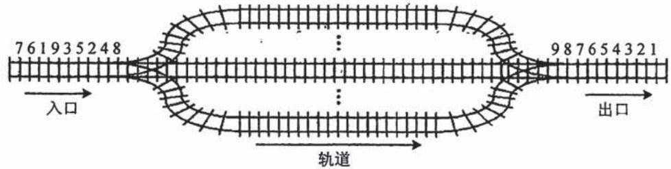
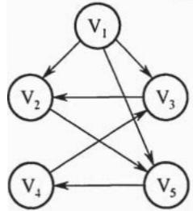

# 2016年数据结构考研真题

## 一、单项选择题

1. 已知表头元素为 c 的单链表在内存中的存储状态如下表所示。

<table><tr><td>地址</td><td>元素</td><td>链接地址</td></tr><tr><td>1000H</td><td>a</td><td>1010H</td></tr><tr><td>1004H</td><td>b</td><td>100CH</td></tr><tr><td>1008H</td><td>c</td><td>1000H</td></tr><tr><td>100CH</td><td>d</td><td>NULL</td></tr><tr><td>1010H</td><td>e</td><td>1004H</td></tr><tr><td>1014H</td><td></td><td></td></tr></table>

现将f存放于1014H处并插入到单链表中，若f在逻辑上位于a和e之间，则a,e,f的"链接地址"依次是

A. $1010\mathrm{H}, 1014\mathrm{H}, 1004\mathrm{H}$

B. $1010\mathrm{H}, 1004\mathrm{H}, 1014\mathrm{H}$

C. $1014\mathrm{H}, 1010\mathrm{H}, 1004\mathrm{H}$

D. $1014 \mathrm{H}, 1004 \mathrm{H}, 1010 \mathrm{H}$

2. 已知一个带有表头结点的双向循环链表 L, 结点结构为 prev data next, 其中, prev 和 next 分别是指向其直接前驱和直接后继结点的指针。现要删除指针 p 所指的结点, 正确的语句序列是

A. $p->next->prev = p->prev; p->prev->next = p->prev; free(p);$   
B. $p->next->prev = p->next; p->prev->next = p->next; free(p);$   
C. $p->next->prev = p->next; p->prev->next = p->prev; free(p);$   
D. $p->next->prev = p->prev; p->prev->next = p->next; free(p);$

3. 设有下图所示的火车车轨，入口到出口之间有 $n$ 条轨道，列车的行进方向均为从左至右，列车可驶入任意一条轨道。现有编号为 $1 \sim 9$ 的9列列车，驶入的次序依次是8,4,2,5,3,9,1,6,7。若期望驶出的次序依次为 $1 \sim 9$ ，则 $n$ 至少是

A. 2

B. 3

C. 4

D. 5

4. 有一个100阶的三对角矩阵 $M$ ，其元素 $m_{i,j}$ （ $1 \leqslant i \leqslant 100, 1 \leqslant j \leqslant 100$ ）按行优先依次压缩

存入下标从0开始的一维数组 $N$ 中。元素 $m_{30,30}$ 在 $N$ 中的下标是

A. 86

B. 87

C. 88

D. 89

5. 若森林F有15条边、25个结点，则F包含树的个数是

A. 8

B. 9

C. 10

D. 11

6. 下列选项中, 不是下图深度优先搜索序列的是

A. $\mathrm{V}_{1}, \mathrm{~V}_{5}, \mathrm{~V}_{4}, \mathrm{~V}_{3}, \mathrm{~V}_{2}$

B. $\mathrm{V}_{1}, \mathrm{~V}_{3}, \mathrm{~V}_{2}, \mathrm{~V}_{5}, \mathrm{~V}_{4}$

C. $\mathrm{V}_{1}, \mathrm{~V}_{2}, \mathrm{~V}_{5}, \mathrm{~V}_{4}, \mathrm{~V}_{3}$

D. $\mathrm{V}_{1}, \mathrm{~V}_{2}, \mathrm{~V}_{3}, \mathrm{~V}_{4}, \mathrm{~V}_{5}$

7. 若将 $n$ （ $n > 1000$ ）个元素的升序数组 A 中查找关键字 x。查找算法的伪代码如下所示。

k=0;

while $(k < n$ 且 $A[k] < x)$ $k = k + 3$ ;

if $(\mathbf{k} <   \mathbf{n}$ 且 $\mathrm{A}[k] == x)$ 查找成功；

else if (k-1<n 且 A[k-1] == x) 查找成功;

else if $(k - 2 < n$ 且 $A[k - 2] == x)$ 查找成功；

else 查找失败;

本算法与折半查找算法相比，有可能具有更少比较次数的情形是________。

A. 当 $\mathbf{x}$ 不在数组中

B. 当 $\mathbf{x}$ 接近数组开头处

C. 当 $\mathrm{x}$ 接近数组结尾处

D. 当 $\mathbf{x}$ 位于数组中间位置

8. 在有 $n$ （ $n > 1000$ ）个元素的升序数组 A 中查找关键字 x。查找算法的伪代码如下所示。

k=0;

while $(k < n$ 且 $A[k] < x)$ $k = k + 3$ ;

if $(\mathbf{k} <   \mathbf{n}$ 且 $\mathrm{A}[k] == x)$ 查找成功；

else if (k-1<n 且 A[k-1] == x) 查找成功;

else if $(k - 2 < n$ 且 $A[k - 2] == x)$ 查找成功；

else 查找失败;

本算法与折半查找算法相比，有可能具有更少比较次数的情形是________。

A. 当 $\mathbf{x}$ 不在数组中

B. 当 $\mathbf{x}$ 接近数组开头处

C. 当 $\mathrm{x}$ 接近数组结尾处

D. 当 $\mathbf{x}$ 位于数组中间位置

9. B+树不同于B树的特点之一是

A. 能支持顺序查找

B. 结点中含有关键字

C. 根结点至少有两个分支

D. 所有叶结点都在同一层上

10. 对 10TB 的数据文件进行排序，应使用的方法是____。

A. 希尔排序

B. 堆排序

C. 快速排序

D. 归并排序

## 二、综合应用题

42. 如果一棵非空 $k (k \geqslant 2)$ 叉树 $T$ 中每个非叶结点都有 $k$ 个孩子，则称 $T$ 为正则 $k$ 叉树。请回答下列问题并给出推导过程。

(1) 若 T 有 $m$ 个非叶结点, 则 T 中的叶结点有多少个?  
(2) 若 $\mathrm{T}$ 的高度为 $h$ (单结点的树 $h = 1$ ), 则 $\mathrm{T}$ 的结点数最多为多少个? 最少为多少个?

43. 已知由 $n$ （ $n \geqslant 2$ ）个正整数构成的集合 $A = \{a_{k} | 0 \leqslant k < n\}$ ，将其划分为两个不相交的子集 $A_{1}$ 和 $A_{2}$ ，元素个数分别是 $n_{1}$ 和 $n_{2}$ ， $A_{1}$ 和 $A_{2}$ 中元素之和分别为 $S_{1}$ 和 $S_{2}$ 。设计一个尽可能高效的划分算法，满足 $|n_{1} - n_{2}|$ 最小且 $|S_{1} - S_{2}|$ 最大。要求：

(1) 给出算法的基本设计思想。  
（2）根据设计思想，采用C或 $\mathbf{C} + +$ 语言描述算法，关键之处给出注释。  
(3) 说明你所设计算法的平均时间复杂度和空间复杂度。