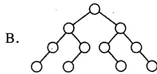
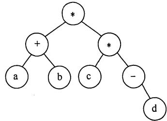
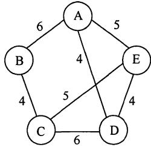

# 2017年数据结构考研真题

## 一、单项选择题

1. 下列函数的时间复杂度是 。

```c
int func(int n){
    int i = 0, sum = 0;
    while(sum < n) sum += ++i;
    return i;
}
```

A. O(logn)

B. O(n^1/2)

C. O(n)

D. O(nlogn)

2. 下列关于栈的叙述中，错误的是

I. 采用非递归方式重写递归程序时必须使用栈  
II. 函数调用时，系统要用栈保存必要的信息  
III. 只要确定了入栈次序，就可确定出栈次序   
IV. 栈是一种受限的线性表，允许在其两端进行操作

A. 仅I

B. 仅II、III

C. 仅III、IV

D. 仅II、III、IV

3. 适用于压缩存储稀疏矩阵的两种存储结构是 。

A. 三元组表和十字链表

B. 三元组表和邻接矩阵

C. 十字链表和二叉链表

D. 邻接矩阵和十字链表

4. 要使一棵非空二叉树的先序序列与中序序列相同，其所有非叶结点须满足的条件是 。

A. 只有左子树

B. 只有右子树

C. 结点的度均为1

D. 结点的度均为2

5. 已知一棵二叉树的树形如右图所示，其后序序列为e,a,c,b,d,g,f，树中与结点a同层的结点是 。


A. c

B. d

C. f

D. g

6. 已知字符集 $\{a, b, c, d, e, f, g, h\}$ ，若各字符的哈夫曼编码依次是0100,10,0000,0101,001,011,11,0001，则编码序列0100011001001011110101 的译码结果是 。

A. acgabfh

B. adbagbb

C. afbeagd

D. afeefgd

7. 已知无向图G含有16条边，其中度为4的顶点个数为3，度为3的顶点个数为4，其他顶点的度均小于3。图G所含的顶点个数至少是 。

A. 10

B. 11

C. 13

D. 15

8. 下列二叉树中，可能成为折半查找判定树（不含外部结点）的是





9. 下列应用中， 适合使用B+树的是

A. 编译器中的词法分析

B. 关系数据库系统中的索引

C. 网络中的路由表快速查找

D. 操作系统的磁盘空闲块

10. 在内部排序时， 若选择了归并排序而没有选择插入排序，则可能的理由是

I. 归并排序的程序代码更短
II. 归并排序的占用空间更少
III. 归并排序的运行效率更高

A. 仅II

B. 仅III

C. 仅I、II

D. 仅I、III

11. 下列排序方法中，若将顺序存储更换为链式存储，则算法的时间效率会降低的是

I. 插入排序
II. 选择排序
III. 起泡排序
IV. 希尔排序
V. 归并排序

A. 仅I、II

B. 仅II、III

C. 仅III、IV

D. 仅IV、V

## 二、综合应用题

41. (15分）请设计一个算法，将给定的表达式树（二叉树）转换为等价的中缀表达式（通过括号反映操作符的计算次序）并输出。 例如， 当下列两棵表达式树作为算法的输入时， 输出的等价中缀表达式分别为 $(a + b) * (c * (-d))$ 和 $(a * b) + (-(c - d))$ 。




二叉树结点定义如下：

```c
typedef struct node{
    char data[10];    //存储操作数或操作符
    struct node *left, *right;
}BTree;
```

要求：

(1)给出算法的基本设计思想。  
(2) 根据设计思想， 采用 C 或 C++ 语言描述算法 ， 关键之处给出注释。

42. (8分）使用 Prim (普里姆）算法求带权连通图的最小（代价）生成树 (MST) 。回答下列问题。

(1)对下列图 G, 从顶点 A 开始求 G的 MST, 依次给出按算法选出的边。



(2) 图 G的 MST是唯一的吗？  
(3)对任意的带权连通图 ， 满足什么条件时， 其 MST是唯一的？