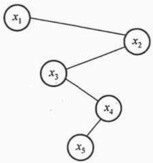
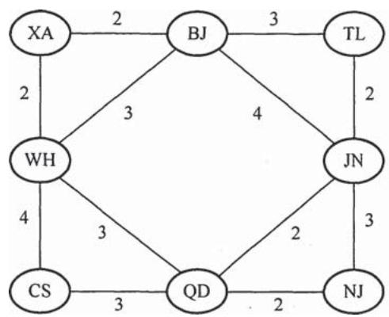

# 2018年数据结构考研真题

## 一、单项选择题

1. 若栈 $S_{1}$ 中保存整数，栈 $S_{2}$ 中保存运算符，函数 $F()$ 依次执行下述各步操作：

（1）从 $\mathbf{S}_1$ 中依次弹出两个操作数a和b；  
（2）从 $\mathbf{S}_2$ 中弹出一个运算符op；  
（3）执行相应的运算bopa；  
（4）将运算结果压入 $S_{1}$ 中。

假定 $\mathbf{S}_1$ 中的操作数依次是5,8,3,2（2在栈顶）， $\mathbf{S}_2$ 中的运算符依次是\*,-,+（+在栈顶）。调用3次 $F()$ 后， $\mathbf{S}_1$ 栈顶保存的值是

A. -15

B. 15

C. -20

D. 20

2. 现有队列 Q 与栈 S，初始时 Q 中的元素依次是 1, 2, 3, 4, 5, 6（1 在队头），S 为空。若仅允许下列 3 种操作：① 出队并输出出队元素；② 出队并将出队元素入栈；③ 出栈并输出出栈元素，则不能得到的输出序列是 ________。

A. 1,2,5,6,4,3

B. 2, 3, 4, 5, 6, 1

C. 3, 4, 5, 6, 1, 2

D. 6,5,4,3,2,1

3. 设有一个 $12 \times 12$ 的对称矩阵 $M$ ，将其上三角部分的元素 $m_{i,j}$ （ $1 \leqslant i \leqslant j \leqslant 12$ ）按行优先存入 C 语言的一维数组 N 中，元素 $m_{6,6}$ 在 N 中的下标是 ______。

A. 50

B. 51

C. 55

D. 66

4. 设一棵非空完全二叉树T的所有叶结点均位于同一层，且每个非叶结点都有2个子结点。若T有 $k$ 个叶结点，则T的结点总数是

A. ${2k} - 1$

B. ${2k}$

C. $k^{2}$

D. $2^{k} - 1$

5. 已知字符集 $\{\mathrm{a},\mathrm{b},\mathrm{c},\mathrm{d},\mathrm{e},\mathrm{f}\}$ ，若各字符出现的次数分别为6,3,8,2,10,4，则对应字符集中各字符的哈夫曼编码可能是

A. 00, 1011, 01, 1010, 11, 100

B. 00, 100, 110, 000, 0010, 01

C. 10, 1011, 11, 0011, 00, 010

D. 0011, 10, 11, 0010, 01, 000

6. 已知二叉排序树如下图所示，元素之间应满足的大小关系是____。

A. $x_{1} <   x_{2} <   x_{5}$

B. $x_{1} <   x_{4} <   x_{5}$

C. $x_{3} <   x_{5} <   x_{4}$

D. $x_{4}< x_{3}< x_{5}$

7. 下列选项中，不是如下有向图的拓扑序列的是________。

A. 1, 5, 2, 3, 6, 4

B. 5, 1, 2, 6, 3, 4

C. 5, 1, 2, 3, 6, 4

D. 5, 2, 1, 6, 3, 4

8. 高度为 5 的 3 阶 B 树含有的关键字个数至少是

A. 15

B. 31

C. 62

D. 242

9. 现有长度为 7、初始为空的散列表 HT, 散列函数 $H(k) = k \% 7$ , 用线性探测再散列法解决冲突。将关键字 22, 43, 15 依次插入到 HT 后, 查找成功的平均查找长度是_____。

A. 1.5

B. 1.6

C. 2

D. 3

10. 对初始数据序列(8,3,9,11,2,1,4,7,5,10,6)进行希尔排序。若第一趟排序结果为(1,3,7,5,2,6,4,9,11,10,8)，第二趟排序结果为(1,2,6,4,3,7,5,8,11,10,9)，则两趟排序采用的增量（间隔）依次是

A. 3, 1

B. 3, 2

C. 5, 2

D. 5, 3

11. 在将数据序列(6, 1, 5, 9, 8, 4, 7)建成大根堆时，正确的序列变化过程是

A. 6, 1, 7, 9, 8, 4, 5 $\rightarrow$ 6, 9, 7, 1, 8, 4, 5 $\rightarrow$ 9, 6, 7, 1, 8, 4, 5 $\rightarrow$ 9, 8, 7, 1, 6, 4, 5   
B. 6,9,5,1,8,4,7 $\rightarrow$ 6,9,7,1,8,4,5 $\rightarrow$ 9,6,7,1,8,4,5 $\rightarrow$ 9,8,7,1,6,4,5   
C. 6, 9, 5, 1, 8, 4, $7 \rightarrow 9$ , 6, 5, 1, 8, 4, $7 \rightarrow 9$ , 6, 7, 1, 8, 4, $5 \rightarrow 9$ , 8, 7, 1, 6, 4, 5   
D. 6, 1, 7, 9, 8, 4, 5 → 7, 1, 6, 9, 8, 4, 5 → 7, 9, 6, 1, 8, 4, 5 → 9, 7, 6, 1, 8, 4, 5 → 9, 8, 6, 1, 7, 4, 5

## 二、综合应用题

41.（13分）给定一个含 $n(n\geqslant 1)$ 个整数的数组，请设计一个在时间上尽可能高效的算法，找出数组中未出现的最小正整数。例如，数组 $\{-5,3,2,3\}$ 中未出现的最小正整数是1；数组 $\{1,2,3\}$ 中未出现的最小正整数是4。要求：

（1）给出算法的基本设计思想。  
(2) 根据设计思想, 采用 C 或 $\mathrm{C}++$ 语言描述算法, 关键之处给出注释。  
(3) 说明你所设计算法的时间复杂度和空间复杂度。

42.（12分）拟建设一个光通信骨干网络连通BJ、CS、XA、QD、JN、NJ、TL和WH等8个城市，题42图中无向边上的权值表示两个城市间备选光纤的铺设费用。

  
题42图

请回答下列问题。

（1）仅从铺设费用角度出发，给出所有可能的最经济的光纤铺设方案（用带权图表示），并计算相应方案的总费用。

（2）题42图可采用图的哪种存储结构？给出求解问题（1）所使用的算法名称。

（3）假设每个城市采用一个路由器按（1）中得到的最经济方案组网，主机H1直接连接在TL的路由器上，主机H2直接连接在BJ的路由器上。若H1向H2发送一个 $\mathrm{TTL} = 5$ 的IP分组，则H2是否可以收到该IP分组？