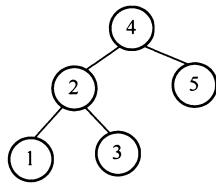
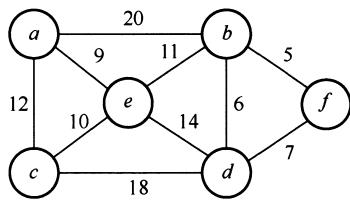

# 2020年数据结构考研真题

## 一、单项选择题

01. 将一个 $10 \times 10$ 对称矩阵 $\pmb{M}$ 的上三角部分的元素 $m_{i,j} (1 \leqslant i \leqslant j \leqslant 10)$ 按列优先存入 C 语言的一维数组 N 中，元素 $m_{7,2}$ 在 N 中的下标是（）。

A. 15

B. 16

C. 22

D. 23

02. 对空栈 $S$ 进行Push和Pop操作，入栈序列为 $a, b, c, d, e$ ，经过Push, Push, Pop, Push, Pop, Push, Push, Pop操作后得到的出栈序列是（ ）。

A. $b, a, c$

B. $b, a, e$

C. $b, c, a$

D. $b, c, e$

03. 对于任意一棵高度为 5 且有 10 个结点的二叉树，若采用顺序存储结构保存，每个结点占 1 个存储单元（仅存放结点的数据信息），则存放该二叉树需要的存储单元数量至少是（）。

A. 31

B. 16

C. 15

D. 10

04. 已知森林 $F$ 及与之对应的二叉树 $T$ ，若 $F$ 的先根遍历序列是 $a, b, c, d, e, f$ ，中根遍历序列是 $b, a, d, f, e, c$ ，则 $T$ 的后根遍历序列是（ ）。

A. $b, a, d, f, e, c$

B. $b, d, f, e, c, a$

C. $b, f, e, d, c, a$

D. $f, e, d, c, b, a$

05. 下列给定的关键字输入序列中，不能生成如下二叉排序树的是（ ）。

A. 4,5,2,1,3

B. 4,5,1,2,3

C. $4,2,5,3,1$

D. 4,2,1,3,5

06. 修改递归方式实现的图的深度优先搜索（DFS）算法，将输出（访问）顶点信息的语句移到退出递归前（即执行输出语句后立刻退出递归）。采用修改后的算法遍历有向无环图 $G$ ，若输出结果中包含 $G$ 中的全部顶点，则输出的顶点序列是 $G$ 的（）。

A. 拓扑有序序列

B. 逆拓扑有序序列

C. 广度优先搜索序列

D. 深度优先搜索序列

07. 已知无向图 $G$ 如下所示，使用克鲁斯卡尔（Kruskal）算法求图 $G$ 的最小生成树，加到最小生成树中的边依次是（ ）。

A. $(b,f),(b,d),(a,e),(c,e),(b,e)$

B. $(b,f),(b,d),(b,e),(a,e),(c,e)$

C. $(a,e),(b,e),(c,e),(b,d),(b,f)$   
D. $(a,e),(c,e),(b,e),(b,f),(b,d)$

08. 若使用 AOE 网估算工程进度，则下列叙述中正确的是（）。

A. 关键路径是从原点到汇点边数最多的一条路径  
B. 关键路径是从原点到汇点路径长度最长的路径   
C. 增加任一关键活动的时间不会延长工程的工期  
D. 缩短任一关键活动的时间将会缩短工程的工期

09. 下列关于大根堆（至少含 2 个元素）的叙述中，正确的是（）。

I. 可以将堆视为一棵完全二叉树

II. 可以采用顺序存储方式保存堆

III. 可以将堆视为一棵二叉排序树

IV. 堆中的次大值一定在根的下一层

A. 仅 I、II

B. 仅 II、III

C. 仅 I、II 和 IV

D. I、III 和 IV

10. 依次将关键字 5, 6, 9, 13, 8, 2, 12, 15 插入初始为空的 4 阶 B 树后，根结点中包含的关键字是（）。

A. 8

B. 6,9

C. 8, 13

D. 9, 12

11. 对大部分元素已有序的数组进行排序时，直接插入排序比简单选择排序效率更高，其原因是（）。

I. 直接插入排序过程中元素之间的比较次数更少   
II. 直接插入排序过程中所需要的辅助空间更少  
III. 直接插入排序过程中元素的移动次数更少

A. 仅 I

B. 仅 III

C. 仅 I、II

D. I、II 和 III

## 二、综合应用题

41.（13分）定义三元组 $(a,b,c)$ （其中 $a,b,c$ 均为正数）的距离 $D = |a - b| + |b - c| + |c - a|$ 。给定3个非空整数集合 $S_{1}$ 、 $S_{2}$ 和 $S_{3}$ ，按升序分别存储在3个数组中。设计一个尽可能高效的算法，计算并输出所有可能的三元组 $(a,b,c)$ （ $a\in S_1,b\in S_2,c\in S_3$ ）中的最小距离。例如 $S_{1} = \{-1,0,9\}$ ， $S_{2} = \{-25, - 10,10,11\}$ ， $S_{3} = \{2,9,17,30,41\}$ ，则最小距离为2，相应的三元组为(9,10,9)。要求：

1）给出算法的基本设计思想。  
2）根据设计思想，采用C或 $\mathrm{C + + }$ 语言描述算法，关键之处给出注释。  
3）说明你所设计算法的时间复杂度和空间复杂度。

42.（10分）若任一个字符的编码都不是其他字符编码的前缀，则称这种编码具有前缀特性。现有某字符集（字符个数 $\geq 2$ ）的不等长编码，每个字符的编码均为二进制的0、1序列，最长为 $L$ 位，且具有前缀特性。请回答下列问题：

1）哪种数据结构适宜保存上述具有前缀特性的不等长编码？  
2）基于你所设计的数据结构，简述从0/1串到字符串的译码过程。  
3）简述判定某字符集的不等长编码是否具有前缀特性的过程。