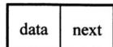
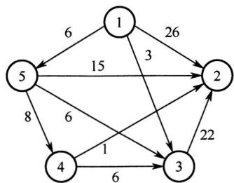

# 2021年数据结构考研真题

## 一、单项选择题

01. 已知头指针 h 指向一个带头结点的非空单循环链表, 结点结构为



其中 next 是指向直接后继结点的指针，p 是尾指针，q 是临时指针。现要删除该链表的第一个元素，正确的语句序列是（）。

A. $\mathrm{h} \rightarrow  \operatorname{next} = \mathrm{h} \rightarrow  \operatorname{next} \rightarrow  \operatorname{next};\mathrm{q} = \mathrm{h} \rightarrow  \operatorname{next};\operatorname{free}\left( \mathrm{q}\right)$ ;   
B. $q = h\rightarrow$ next; $\mathbf{h}\cdot \cdot \mathbf{\nabla}^{n}\mathbf{e}t = \mathbf{h}\cdot \cdot \mathbf{\nabla}^{n}\mathbf{e}t$ next- $\cdot \cdot \cdot$ next; free(q);   
C. $q = h \rightarrow$ next; $h \rightarrow$ next $= q \rightarrow$ next; if $(p != q)p = h$ ; free(q);   
D. $q = h\rightarrow$ next; $\mathbf{h}\cdot \cdot \mathbf{\nabla}^{>}$ next $= q\cdot \cdot \cdot >$ next; if $(p == q)p = h$ ; free(q);

02. 已知初始为空的队列 Q 的一端仅能进行入队操作, 另外一端既能进行入队操作又能进行出队操作。若 Q 的入队序列是 $1, 2, 3, 4, 5$ , 则不能得到的出队序列是 ( )。

A. 5,4,3,1,2

B. 5,3,1,2,4

C. $4,2,1,3,5$

D. 4,1,3,2,5

03. 已知二维数组 A 按行优先方式存储, 每个元素占用 1 个存储单元。若元素 A[0][0]的存储地址是 100, A[3][3]的存储地址是 220, 则元素 A[5][5]的存储地址是 ( )。

A. 295

B. 300

C. 301

D. 306

04. 某森林 $F$ 对应的二叉树为 $T$ , 若 $T$ 的先序遍历序列是 $\mathbf{a}, \mathbf{b}, \mathbf{d}, \mathbf{c}, \mathbf{e}, \mathbf{g}, \mathbf{f}$ , 中序遍历序列是 $\mathbf{b}, \mathbf{d}, \mathbf{a}, \mathbf{e}, \mathbf{g}, \mathbf{c}, \mathbf{f}$ , 则 $F$ 中树的棵数是（ ）。

A. 1

B. 2

C. 3

D. 4

05. 若某二叉树有 5 个叶结点, 其权值分别为 10, 12, 16, 21, 30 , 则其最小的带权路径长度 (WPL) 是 ( )。

A. 89

B. 200

C. 208

D. 289

06. 给定平衡二叉树如下图所示，插入关键字 23 后，根中的关键字是（）。


A. 16

B. 20

C. 23

D. 25

07. 给定如下有向图，该图的拓扑有序序列的个数是（ ）。


A. 1

B. 2

C. 3

D. 4

08. 使用 Dijkstra 算法求下图中从顶点 1 到其余各顶点的最短路径, 将当前找到的从顶点 1 到顶点 2,3,4,5 的最短路径长度保存在数组 dist 中, 求出第二条最短路径后, dist 中的内容更新为 ( )。



A. 26,3,14,6

B. 25,3,14,6

C. 21,3,14,6

D. 15,3,14,6

09. 在一棵高度为 3 的 3 阶 B 树中，根为第 1 层，若第 2 层中有 4 个关键字，则该树的结点个数最多是（）。

A. 11

B. 10

C. 9

D. 8

10. 设数组 $\mathbf{S}[] = \{93, 946, 372, 9, 146, 151, 301, 485, 236, 327, 43, 892\}$ ，采用最低位优先（LSD）基数排序将 S 排列成升序序列。第 1 趟分配、收集后，元素 372 之前、之后紧邻的元素分别是（）。

A. 43,892

B. 236, 301

C. 301, 892

D. 485, 301

11. 将关键字 6,9,1,5,8,4,7 依次插入到初始为空的大根堆 H 中，得到的 H 是（）。

A. 9,8,7,6,5,4,1

B. 9, 8, 7, 5, 6, 1, 4

C. 9, 8, 7, 5, 6, 4, 1

D. 9, 6, 7, 5, 8, 4, 1

## 二、综合应用题

41.（15分）已知无向连通图 $G$ 由顶点集 $V$ 和边集 $E$ 组成， $|E| > 0$ ，当 $G$ 中度为奇数的顶点个数为不大于2的偶数时， $G$ 存在包含所有边且长度为 $|E|$ 的路径（称为EL路径）。设图 $G$ 采用邻接矩阵存储，类型定义如下：

```c
typedef struct{ //图的定义  
int numVertices, numEdges; //图中实际的顶点数和边数  
char VerticesList[MAXV]; //顶点表。MAXV为已定义常量  
int Edge[MAXV][MAXV]; //邻接矩阵
}MGraph;
```

请设计算法 int IsExistEL(MGraph G)，判断 $G$ 是否存在 EL 路径，若存在，则返回1，否则返回0。要求：

1）给出算法的基本设计思想。  
2）根据设计思想，采用C或 $\mathbf{C} + +$ 语言描述算法，关键之处给出注释。  
3）说明你所设计算法的时间复杂度和空间复杂度。

42.（8分）已知某排序算法如下：

```c
void cmpCountSort(int a[],int b[],int n)  
{ int i,j,*count; 
  count=(int *)malloc(sizeof(int)*n); //C++语言：count=new int[n]; 
  for(i=0;i<n;i++) count[i]=0; 
  for(i=0;i<n-1;i++) 
    for(j=i+1;j<n;j++) 
      if(a[i]<a[j]) count[j]++; 
      else count[i]++; 
  for(i=0;i<n;i++) b[count[i]]=a[i]; 
  free(count); //C++语言：delete count; 
} 
```

请回答下列问题。

1）若有int a[] = {25, -10, 25, 10, 11, 19}, b[6];，则调用cmpCountSort(a, b, 6)后数组b中的内容是什么？  
2）若 $a$ 中含有 $n$ 个元素, 则算法执行过程中, 元素之间的比较次数是多少?   
3）该算法是稳定的吗？若是，则阐述理由；否则，修改为稳定排序算法。