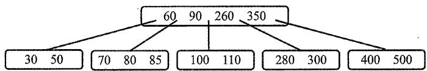

# 2022年数据结构考研真题

## 一、单项选择题

01. 下列程序段的时间复杂度是（ ）。

int sum = 0;  
for (int i = 1; i < n; i *= 2)  
    for (int j = 0; j < i; j++)  
        sum++;

A. $O(\log n)$

B. $O(n)$

C. $O(n \log n)$

D. $O\left(n^{2}\right)$

02. 给定有限符号集 S, in 和 out 均为 S 中所有元素的任意排列。对于初始为空的栈 ST, 下列叙述中, 正确的是 ( )。

A. 若 in 是 ST 的入栈序列, 则不能判断 out 是否为其可能的出栈序列  
B. 若 out 是 ST 的出栈序列, 则不能判断 in 是否为其可能的入栈序列  
C. 若 in 是 ST 的入栈序列, out 是对应 in 的出栈序列, 则 in 与 out 一定不同  
D. 若 in 是 ST 的入栈序列, out 是对应 in 的出栈序列, 则 in 与 out 可能互为倒序

03. 若结点 $\mathfrak{p}$ 与 $\mathbf{q}$ 在二叉树T的中序遍历序列中相邻，且 $\mathfrak{p}$ 在 $\mathbf{q}$ 之前，则下列 $\mathfrak{p}$ 与 $\mathbf{q}$ 的关系中，不可能的是（）。

I. q是p的双亲

II. $\mathbf{q}$ 是 $\mathfrak{p}$ 的右孩子

III. q是p的右兄弟

IV. q是p的双亲的双亲

A. 仅 I

B. 仅 III

C. 仅 II、III

D. 仅 II、IV

04. 若三叉树 T 中有 244 个结点（叶结点的高度为 1），则 T 的高度至少是（）。

A. 8

B. 7

C. 6

D. 5

05. 对任意给定的含 $n$ （ $n > 2$ ）个字符的有限集 S，用二叉树表示 S 的哈夫曼编码集和定长编码集，分别得到二叉树 T1 和 T2。下列叙述中，正确的是（）。

A. T1 与 T2 的结点数相同  
B. T1 的高度大于 T2 的高度  
C. 出现频次不同的字符在 T1 中处于不同的层  
D. 出现频次不同的字符在 T2 中处于相同的层

06. 对于无向图 $\mathbf{G} = (\mathrm{V},\mathrm{E})$ ，下列选项中，正确的是（ ）。

A. 当 $|\mathrm{V}| > |\mathrm{E}|$ 时， $\mathbf{G}$ 一定是连通的  
B. 当 $|\mathrm{V}| < |\mathrm{E}|$ 时, $\mathrm{G}$ 一定是连通的  
C. 当 $|\mathrm{V}| = |\mathrm{E}| - 1$ 时，G一定是不连通的  
D. 当 $|\mathrm{V}| > |\mathrm{E}| + 1$ 时, $\mathrm{G}$ 一定是不连通的

07. 在下图所示的5阶B树T中，删除关键字260之后需要进行必要的调整，得到新的B树T1。下列选项中，不可能是T1根结点中关键字序列的是（）。



A. 60, 90, 280

B. 60, 90, 350

C. 60, 85, 110, 350

D. 60, 90, 110, 350

08. 下列因素中，影响散列（哈希）方法平均查找长度的是（ ）。

I. 装填因子

II. 散列函数

III. 冲突解决策略

A. 仅 I、II

B. 仅 I、III

C. 仅 II、III

D. I、II、III

09. 使用二路归并排序对含 $n$ 个元素的数组 M 进行排序时，二路归并操作的功能是（）。

A. 将两个有序表合并为一个新的有序表  
B. 将 M 划分为两部分, 两部分的元素个数大致相等  
C. 将 $\mathbf{M}$ 划分为 $n$ 个部分, 每个部分中仅含有一个元素  
D. 将 M 划分为两部分, 一部分元素的值均小于另一部分元素的值

10. 对数据进行排序时，若采用直接插入排序而不采用快速排序，则可能的原因是（）。

I. 大部分元素已有序

II. 待排序元素数量很少

III. 要求空间复杂度为 $O(1)$

IV. 要求排序算法是稳定的

A. 仅 I、II

B. 仅 III、IV

C. 仅 I、II、IV

D. I、II、III、IV

## 二、综合应用题

41.（13分）已知非空二叉树T的结点值均为正整数，采用顺序存储方式保存，数据结构定义如下：

```c
typedef struct{ //MAX_SIZE为已定义常量
int SqBiTreeNode[MAX_SIZE]； //保存二叉树结点值的数组
int ElemNum; //实际占用的数组元素个数
}SqBiTree;
```

T中不存在的结点在数组SqBiTNode中用-1表示。例如，对于下图所示的两棵非空二叉树T1和T2,

  
二叉树T1

  
二叉树T2

T1的存储结果如下：

T1.SqBiTNode

<table><tr><td>40</td><td>25</td><td>60</td><td>-1</td><td>30</td><td>-1</td><td>80</td><td>-1</td><td>-1</td><td>27</td><td></td><td></td></tr></table>

T1.ElemNum = 10

T2的存储结果如下：

T2.SqBiTNode

<table><tr><td>40</td><td>50</td><td>60</td><td>-1</td><td>30</td><td>-1</td><td>-1</td><td>-1</td><td>-1</td><td>-1</td><td>35</td><td></td></tr></table>

T2.ElemNum $= 11$

请设计一个尽可能高效的算法，判定一棵采用这种方式存储的二叉树是否为二叉搜索树，若是，则返回 true，否则，返回 false。要求：

1）给出算法的基本设计思想。  
2）根据设计思想，采用C或 $\mathbf{C} + +$ 语言描述算法，关键之处给出注释。

42.（10分）现有 $n(n > 100000)$ 个数保存在一维数组M中，需要查找M中最小的10个数。请回答下列问题。

1）设计一个完成上述查找任务的算法，要求平均情况下的比较次数尽可能少，简述其算法思想（不需要程序实现）。  
2）说明你所设计的算法平均情况下的时间复杂度和空间复杂度。