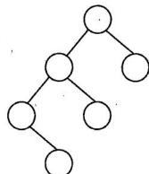
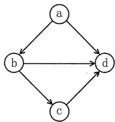

# 2023年数据结构考研真题

## 一、单项选择题

1.  下列对顺序存储的有序表（长度为 $n$ ）实现给定操作的算法中，平均时间复杂度为 $O(1)$ 的是（）。

A. 查找包含指定值元素的算法

B. 插入包含指定值元素的算法

C. 删除第 $i(1 \leqslant i \leqslant n)$ 个元素的算法

D. 获取第 $i$ （ $1\leqslant i\leqslant n$ ）个元素的算法

2.  现有非空双向链表 L, 其结点结构为: prev data next, prev 是指向直接前驱结点的指针, next 是指向后继结点的指针。若要在 L 中指针 p 所指向的节点 (非尾结点) 之后插入指针 s 指向的新结点, 则在执行了语句序列 "s -> next = p -> next; p -> next = s" 后, 下列语句序列中还需要执行的是 ( )。

A. s -> next -> prev = p; s -> prev = p;  
B. p->next->prev = s; s->prev = p;  
C. $s \rightarrow \text{prev} = s \rightarrow \text{next} \rightarrow \text{prev}; s \rightarrow \text{next} \rightarrow \text{prev} = s;$  
D. $p \rightarrow$ next -> prev = s -> prev; $s \rightarrow$ next -> prev = p;

3.  若采用三元组表存储结构存储稀疏矩阵 M，则除三元组表外，下列数据中还需要保存的是（）。

I. M的行数

II. M中包含非零元素的行数

III.M的列数

IV.M中包含非零元素的列数

A. 仅 I、III

B. 仅 I、IV

C. 仅 II、IV

D. I、II、III、IV

4.  在由 6 个字符组成的字符集 S 中, 各字符出现的频次分别为 3, 4, 5, 6, 8, 10, 为 S 构造的哈夫曼编码的加权平均长度为 ( )。

A. 2.4

B. 2.5

C. 2.67

D. 2.75

5.  已知一棵二叉树的树形如右图所示，若其后序遍历序列为 f, d, b, e, c, a，则其先（前）序遍历序列是（）。

A. a, e, d, f, b, c

B. a, c, e, b, d, f

C. c, a, b, e, f, d

D. d, f, e, b, a, c



6.  已知无向连通图 G 中各边的权值均为 1。下列算法中，一定能够求出图 G 中从某顶点到其余各个顶点最短路径的是（）。

I.普里姆（Prim）算法

II. 克鲁斯卡尔（Kruskal）算法

III. 广度优先搜索算法

A. 仅 I

B. 仅 III

C. 仅 I、II

D. I、II、III

7.  下列非空 $B$ 树的叙述中，正确的是（）。

I. 插入操作可能增加树的高度

II. 删除操作一定会导致叶结点的变化

III.查找某关键字总是要查找到叶结点

IV.插入的新关键字最终位于叶结点中

A. 仅 I

B. 仅 I、II

C. 仅 III、IV

D. 仅 I、II、IV

8.  对含有 600 个元素的有序顺序表进行折半查找, 关键字间的比较次数最多是 ( )。

A. 9

B. 10

C. 30

D. 300

9.  现有长度为 5, 初始为空的散列表 HT, 散列表函数 $H(k) = (k + 4)\% 5$ , 用线性探查再散列法解决冲突。若将关键字序列 2022, 12, 25 依次插入 HT 中, 然后删除关键字 25, 则 HT 中查找失败的平均查找长度为( )。

A. 1

B. 1.6

C. 1.8

D. 2.2

10. 下列排序算法中，不稳定的是（）。

I. 希尔排序

Ⅱ. 归并排序

III. 快速排序

IV.堆排序

V. 基数排序

A. 仅 I、II

B. 仅 II、V

C. 仅 I、III、IV

D. 仅 III、IV、V

11. 使用快速排序算法对数据进行升序排序，若经过一次划分后得到的数据序列是68，11，70，23，80，77，48，81，93，88，则该次划分的枢轴是（）。

A. 11

B. 70

C. 80

D. 81

## 二、综合应用题

41. (13分)已知有向图G采用邻接矩阵存储，类型定义如下：

```c
typedef struct { // 图的类型定义
int numVertices, numEdges; // 图的顶点数和有向边数
char VerticesList[MAXV]; // 顶点表，MAXV为已定义常量
int Edge[MAXV][MAXV]; // 邻接矩阵
} MGraph;
```

将图中出度大于入度的顶点称为K顶点。例如：在右图中，顶点a和顶点b都是K顶点。请设计算法：int printVertices(MGraph G)，对任意给定的非空有向图G，输出图G中所有的K顶点，并返回K顶点的个数。要求：



(1) 给出算法的基本设计思想。

(2) 根据设计思想，采用 C 或 $\mathbf{C} + +$ 语言描述算法，关键之处给出注释。

42. (10分)对含有 $n(n > 0)$ 个记录的文件进行外部排序，采用置换-选择排序生成初始归并段时需要使用一个工作区，工作区中能保存 $m$ 个记录，请回答下列问题：

(1) 若文件中有 19 个记录, 其关键字依次是 51, 94, 37, 92, 14, 63, 15, 99, 48, 56, 23, 60, 31, 17, 43, 8, 90, 166, 100。当 $m = 4$ 时, 可生成几个初始归并段? 每个归并段各是什么?  
(2) 对任意 $m (n \gg m > 0)$ ，生成的第一个初始归并段的长度最大值和最小值分别是多少？
